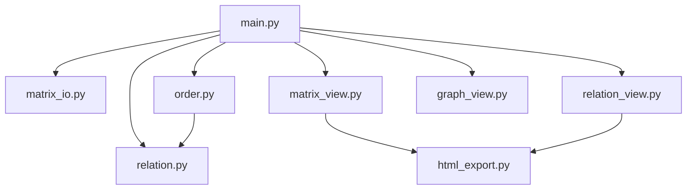

# Plan v1.4 — Funcionamiento lógico del programa (v1.0)

Este documento describe **cómo funciona internamente** la aplicación en [`v1.0/`](v1.0/): flujo de datos, responsabilidad de cada módulo, definiciones implementadas y cómo se construye la visualización del **grafo dirigido**. El manual de usuario paso a paso está en **[README.md](README.md)**.

**Enunciado:** [Proyecto_Final_M.D..pdf](Proyecto_Final_M.D..pdf)

---

## 1. Idea central

Se modela un conjunto finito **X = {x₁,…,xₙ}** y una relación **R ⊆ X×X** mediante una matriz **MR** de tamaño **n×n**:

- **MR[i,j] = True** ⇔ **xᵢ R xⱼ** (índices **0-based** en NumPy; etiquetas **x_{k}** con **k = i+1**).

En teclado el usuario escribe **0/1**; en memoria la matriz es **`numpy.ndarray` con `dtype=bool`**. Las operaciones de propiedades usan lógica booleana y, para transitividad, el **producto booleano** vía `np.matmul` sobre matrices booleanas.

---

## 2. Mapa de módulos y dependencias

| Módulo | Rol |
|--------|-----|
| [`main.py`](v1.0/main.py) | Orquestación: `prompt_n`, `prompt_mode`, `load_matrix`, menú, llamadas a vistas y análisis. |
| [`matrix_io.py`](v1.0/matrix_io.py) | Validación de **n**, lectura manual celda a celda, matriz aleatoria, normalización a matriz bool cuadrada. |
| [`relation.py`](v1.0/relation.py) | Extracción de pares **R**, propiedades relacionales, equivalencia, contraejemplo de transitividad. |
| [`order.py`](v1.0/order.py) | Orden parcial, total y estricto **compuestos** a partir de las propiedades en `relation.py`. |
| [`matrix_view.py`](v1.0/matrix_view.py) | Figura Plotly tipo tabla para **MR** → HTML. |
| [`relation_view.py`](v1.0/relation_view.py) | Tabla HTML de pares **R** (o página mínima si **R** vacío). |
| [`graph_view.py`](v1.0/graph_view.py) | DiGraph NetworkX + layout + Plotly + escritura `grafo_dirigido.html`. |
| [`html_export.py`](v1.0/html_export.py) | Escribir string HTML en disco y opcionalmente abrir navegador (matriz y relación). |

---

## 3. Flujo de ejecución (`main.run`)

1. **`load_matrix()`**  
   - `prompt_n()` → `matrix_io.parse_positive_int` en bucle hasta éxito.  
   - `prompt_mode()` → `"manual"` o `"random"` y semilla opcional.  
   - `matrix_io.acquire_matrix(...)` devuelve `ndarray` bool **n×n**.

2. **Bucle del menú**  
   - Opciones 1–2: salida consola + HTML (vistas).  
   - Opción 3–4: solo consola (propiedades / una propiedad).  
   - Opción 5: `graph_view.show_directed_graph`.  
   - Opción 6: vuelve a `load_matrix()`.

No hay estado global fuera de la variable **`m`** en `run()`.

---

## 4. Entrada de datos (`matrix_io.py`)

### 4.1 `parse_positive_int`

- Rechaza vacío, no entero, **n < 1**.  
- No impone máximo superior: el límite práctico es **RAM** y uso humano.

### 4.2 `ensure_square_bool_matrix`

- Exige `ndim == 2` y `shape[0] == shape[1]`.  
- Devuelve copia **`astype(bool)`**.

### 4.3 `read_matrix_manual`

- Recorre **i = 0..n-1**, **j = 0..n-1**.  
- Prompt muestra **fila/columna 1-based** y **restantes = n² - filled_before_cell**.  
- Tras **exactamente 2** celdas llenas, si **n² > 2**, pregunta autocompletado; **`y`** rellena el resto con `random.choice((False, True))`.

### 4.4 `random_matrix`

- Si hay semilla, `random.seed`.  
- Cada celda: `random.choice((False, True))`.

### 4.5 `acquire_matrix`

- `"manual"` → `read_matrix_manual` + `ensure_square_bool_matrix`.  
- `"random"` → `random_matrix` + `ensure_square_bool_matrix`.

---

## 5. Relación R y propiedades (`relation.py`)

### 5.1 Conjunto **R**

- `pairs_from_matrix`: todos los `(x_{i+1}, x_{j+1})` con **M[i,j] True**.  
- `format_relation_r`: cadena `R = { ... }` o `R = ∅`.

### 5.2 Propiedades (sobre **M** bool)

| Función | Criterio implementado |
|---------|------------------------|
| `is_reflexive` | Toda la diagonal **True**. |
| `is_irreflexive` | Toda la diagonal **False**. |
| `is_symmetric` | **M == M.T** elemento a elemento. |
| `is_asymmetric` | **not** `(M & M.T).any()` (no hay par simétrico, incluida diagonal ⇒ irreflexiva). |
| `is_antisymmetric` | Para todo **i≠j**, no (**M[i,j]** y **M[j,i]**). |
| `boolean_square` | **np.matmul(M, M)** con **M** bool (producto booleano estándar en NumPy). |
| `is_transitive` | Sea **M² = boolean_square(M)**. Transitiva si **∀i,j: ¬M²[i,j] ∨ M[i,j]** (equivalente a **M² ⇒ M** punto a punto). |
| `is_equivalence` | reflexiva **∧** simétrica **∧** transitiva. |

### 5.3 Contraejemplo de transitividad

`transitive_counterexample` busca el primer triple **i,j,k** con **M[i,j]** y **M[j,k]** y no **M[i,k]**, y devuelve texto explicativo con etiquetas **x_k**.

---

## 6. Órdenes (`order.py`)

Depende solo de **`relation`**:

| Función | Definición en código |
|---------|----------------------|
| `is_partial_order` | `is_reflexive ∧ is_antisymmetric ∧ is_transitive` |
| `is_total_order` | `is_partial_order` **y** ∀**i≠j**, **M[i,j] ∨ M[j,i]** |
| `is_strict_order` | `is_irreflexive ∧ is_asymmetric ∧ is_transitive` |

**Nota:** Si el profesor usa otra convención para “orden total” (por ejemplo grafo de comparabilidad distinto) o “estricto”, el informe debe citar la definición del curso y contrastarla con estas líneas.

---

## 7. Visualización HTML

### 7.1 Matriz (`matrix_view.py`)

- Construye `go.Table`: primera columna índice **x_i**, cabecera columnas **x_j**.  
- Celdas muestran **0/1** (`m.astype(int)` solo para **presentación**).  
- `fig.to_html(..., include_plotlyjs="cdn")` → string → [`html_export.write_and_open_html`](v1.0/html_export.py) → `matriz_relacional.html`.

### 7.2 Relación (`relation_view.py`)

- Si no hay pares: HTML estático mínimo con **R = ∅**.  
- Si hay pares: tabla dos columnas **Elemento a / Elemento b** → `relacion_R.html`.

### 7.3 Grafo dirigido (`graph_view.py`)

Pipeline:

1. **MR** → `uint8` → `nx.from_numpy_array(..., create_using=nx.DiGraph)`.  
2. **Layout:** `spring_layout` con semilla fija; si falla import **scipy**, `circular_layout`.  
3. **Nodos:** `Scatter` `markers+text` en coordenadas **pos[i]**.  
4. **Aristas:** por cada `(u,v)` en `g.edges()`:
   - Segmento acortado con factor **`shrink`** para que la flecha no quede oculta bajo el marcador.  
   - Una **anotación** Plotly con `showarrow=True`, `standoff` / `startstandoff` para acercar la punta al nodo.  
5. **Figura** → `fig.write_html` en **`grafo_dirigido.html`** (archivo local).  
6. `webbrowser.open(file://...)` si el SO lo permite.

El grafo es **dirigido** porque solo se añaden aristas **u→v** según la matriz y las flechas se dibujan en ese sentido.

---

## 8. Contrato de datos entre funciones

- Todas las funciones de **`relation`** y **`order`** aceptan cualquier `array_like` y hacen **`np.asarray(..., dtype=bool)`** internamente donde aplica.  
- **`graph_view`** rechaza matriz vacía (**n == 0**).  
- **`main`** captura excepciones genéricas en vistas HTML y grafo para no tumbar el menú completo ante fallos de UI.

---

## 9. Complejidad y límites prácticos

| Operación | Orden típico |
|-----------|----------------|
| Propiedades simétricas / diagonal | **O(n²)** |
| Antisimétrica (bucles dobles) | **O(n²)** |
| Transitividad vía **M²** | **O(n³)** en la multiplicación booleana |
| Generación HTML grafo | **O(|V| + |E|)** para construir trazas y anotaciones; **|E|** puede ser hasta **n²** |

---

## 10. Relación con el PDF (solo parte lógica)

Las normativas **a–g** del PDF quedan cubiertas por el diseño anterior; la **h)** (validación) se cumple en entrada de **n** y celdas; las salidas son deterministas a partir de **MR**. La entrega en **ZIP**, informe con portada y ejecutable ya construido son **fuera** del código y deben prepararse aparte.
